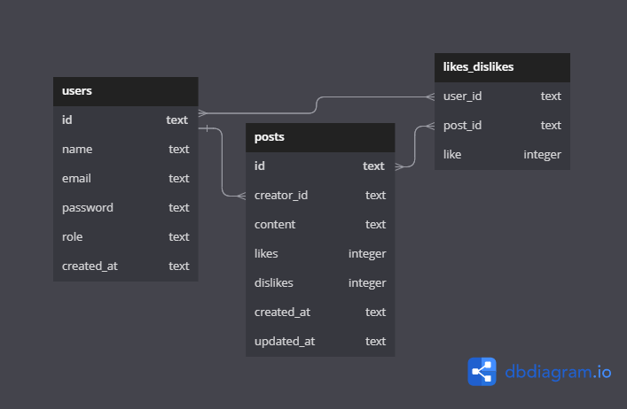

# Backend Project - Labook

## 📝 Description

User management API, posts and interactions made on the social network Labook. It is an express server back-end application with SQLite3 database, where there is data protection and code organization based on layered architecture concepts.
It aims to promote connection and interaction between people. Those who register in the application will be able to create and like publications.

### DATABASE

https://dbdiagram.io/d/63d16443296d97641d7c1ae1

## 📜 Documentation

https://documenter.getpostman.com/view/24460805/2s93CRJWGq

## 🕹 Endpoints

- Login 

USERS
- GET All Users;
- POST Create User; 
- DEL Delete User; 

POSTS
- GET All Posts;
- POST Create Post;
- PUT Edit Post;
- DEL Delete Post;
- PUT Like or Dislike.

## 🛠 Technologies

- NodeJS;
- Typescript;
- Express;
- SQL e SQLite;
- Knex;
- POO;
- Layered Architecture;
- UUID;
- Hashing Passwords;
- Authentication and Authorization;
- Routing;
- Postman.

## 👩‍💻 Author

Laís Rodrigues Macedo  
📧 laisrodriguesmacedo@gmail.com  
📞 (+49) 174 7781517
